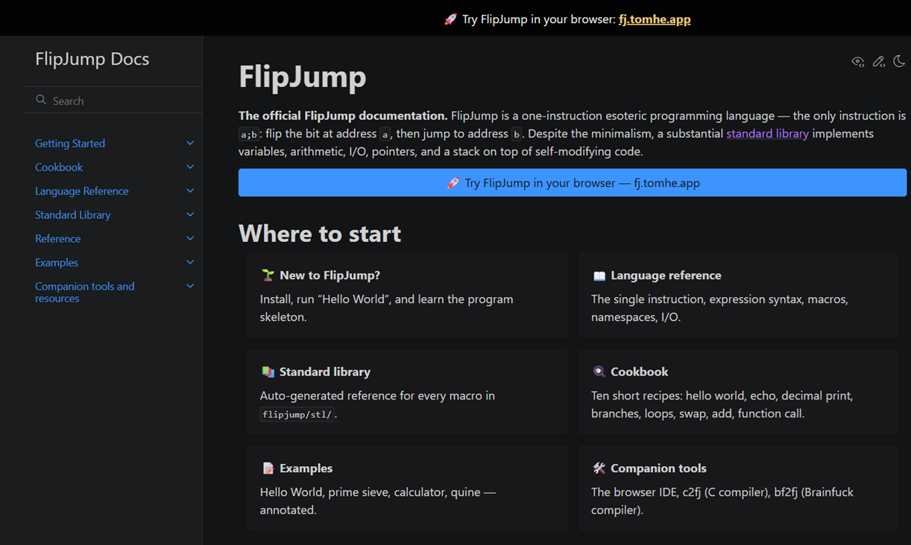

# flipjump-docs

<p align="center">
  <a href="https://fjdocs.tomhe.app">
    
  </a>
</p>

[](https://github.com/tomhea/flipjump-docs/actions/workflows/deploy.yml)
[](https://github.com/tomhea/flipjump-docs/actions/workflows/pr-build.yml)
[](LICENSE)
[](https://fjdocs.tomhe.app)

Source for [fjdocs.tomhe.app](https://fjdocs.tomhe.app) — the documentation site for the [FlipJump](https://github.com/tomhea/flipjump) esoteric language.

The site is built with [Sphinx](https://www.sphinx-doc.org/) + [MyST-Parser](https://myst-parser.readthedocs.io/) + the [Furo](https://pradyunsg.me/furo/) theme. Per-file and per-macro reference pages are auto-generated from the [`flipjump/stl/`](https://github.com/tomhea/flipjump/tree/main/flipjump/stl) source by a Sphinx extension at `docs/_ext/fj_stl_extract.py`.

## Repo layout

```
flipjump-docs/
├── vendor/flip-jump/        # git submodule, pinned to a flip-jump commit
├── docs/
│   ├── source/              # conf.py + hand-written Markdown + auto-generated _generated/
│   ├── _ext/                # Sphinx extension (parser) + Pygments lexer + templates
│   ├── Makefile, make.bat, requirements.txt
│   └── _build/              # output (gitignored)
└── .github/workflows/       # deploy + PR build + weekly submodule bump
```

## Local development

Prerequisites: Python 3.12+, git.

```sh
# Clone with the flip-jump submodule
git clone --recurse-submodules https://github.com/tomhea/flipjump-docs.git
cd flipjump-docs

# Create venv, install deps, build
python -m venv .venv
source .venv/bin/activate     # Windows: .venv\Scripts\Activate.ps1
pip install -r docs/requirements.txt
cd docs && make html

# Live preview during writing
pip install sphinx-autobuild
sphinx-autobuild source _build/html
```

If you already cloned without `--recurse-submodules`:

```sh
git submodule update --init --recursive
```

To bump the flip-jump submodule to its latest `main` (regenerating the STL docs against newer source):

```sh
git submodule update --remote vendor/flip-jump
git add vendor/flip-jump && git commit -m "Bump flip-jump submodule"
```

A weekly GitHub Actions cron (`.github/workflows/submodule-bump.yml`) does this automatically and opens a PR if anything changed.

## Contributing

See **[CONTRIBUTING.md](CONTRIBUTING.md)** and the [Code of Conduct](CODE_OF_CONDUCT.md).

In short: **never push to `main`** — branch protection enforces pull requests. Open a
PR from a feature branch, and ship every change with a test that CI runs (`pytest`
for the Python tooling, a clean `cd docs && make html` for content, and `actionlint`
for workflows).

## Deploy

Pushing to `main` triggers `.github/workflows/deploy.yml`, which builds with Sphinx and rsyncs `docs/_build/html/` to the server hosting `fjdocs.tomhe.app`.

Required GitHub Actions secrets (Settings → Secrets and variables → Actions):

| Secret | Purpose |
|--------|---------|
| `SSH_HOST` | `tomhe.app` |
| `SSH_USER` | `fjdocs` |
| `PRIVATE_SSH_KEY` | SSH private key matching the public key in `fjdocs@tomhe.app:~/.ssh/authorized_keys` |
| `WEB_ROOT_PATH` | Absolute path on the server where the static files are served from |

The server is preconfigured to serve `WEB_ROOT_PATH` as `fjdocs.tomhe.app`. No further server-side setup is required.

## License

BSD 2-Clause — see [LICENSE](LICENSE). Matches upstream [flip-jump](https://github.com/tomhea/flipjump).
